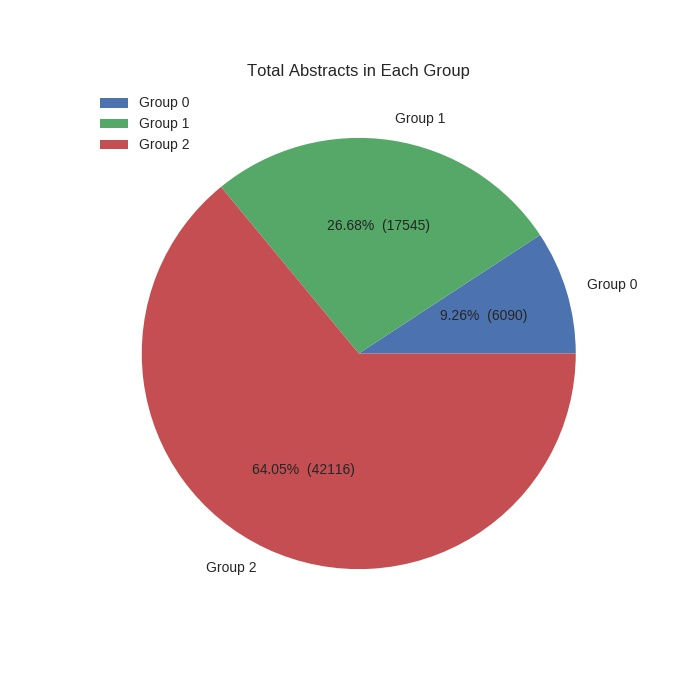
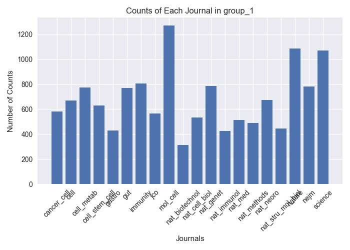
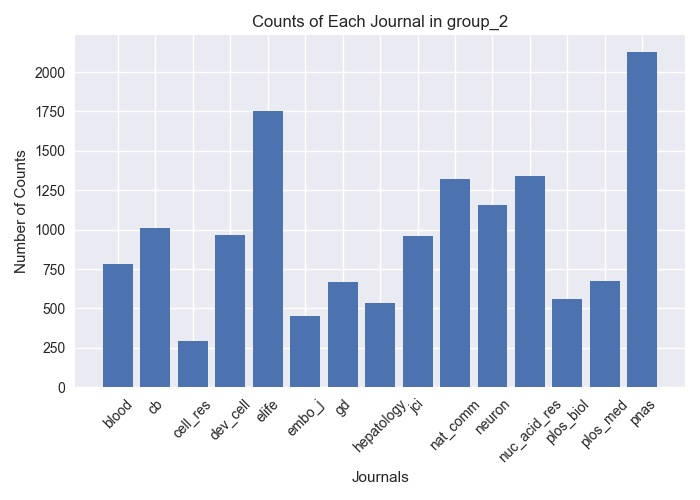
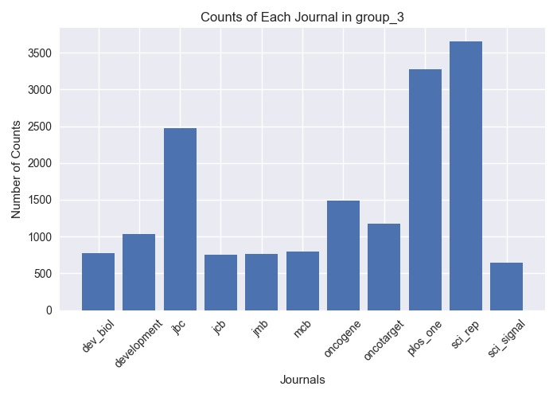

## **Predict Research Significance Based on Its Abstract**

#### A. Data Collection  
Raw data were fetched from [Pubmed](https://www.ncbi.nlm.nih.gov/pubmed/) in Medline format with different start date, and were divided into three groups:  
  * **Group 1** includes publications from **20** journals:  
  Nature (from: 2017-01-01), Science (from: 2017-01-01), Cell (from: 2017-01-01), New England Journal of Medicine (nejm) (from: 2015-01-01), Nature Genetics (nat_genet) (from: 2015-01-01), Nature Biotechnology (nat_biotechnol) (from: 2015-01-01), Nature Medicine (nat_med) (from: 2015-01-01). 
  Cancer Cell (from: 2015-01-01), 
Nature Immunology (nat_immunol) (from: 2015-01-01), 
Cell Metabolism (cell_metab) (from: 2015-01-01), 
Cell Stem Cell (from: 2015-01-01), 
Nature Cell Biology (nat_cell_biol) (from: 2015-01-01), Nature Methods (nat_methods) (from: 2015-01-01), Nature Structural & Molecular Biology (nat_stru_mol_biol) (from: 2015-01-01), Nature Neuroscience (nat_neuro) (from: 2015-01-01), 
Molecular Cell (mol_cell) (from: 2015-01-01), Immunity (from: 2015-01-01), Journal of Clinical Oncology (jco) (from: 2017-01-01), Gut (from: 2015-01-01), Gastroenterology (gastro) (from: 2017-01-01). 

* **Group 2** includes publications from **15** journals:  
Neuron (from: 2016-01-01), The Journal of Clinical Investigation (jci) (from: 2017-01-01), Hepatology (from: 2017-01-01), Blood (from: 2017-01-01), Genes & Development (gd) (from: 2015-01-01), Developmental Cell (dev_cell) (from: 2015-01-01), Elife (from: 2017-01-01), Proceedings of the National Academy of Sciences of the United States of America (pnas) (from: 2017-09-01), PLOS Biology (plos_biol) (from: 2016-01-01), Current Biology (cb) (from: 2017-01-01), Nucleic Acids Research (nuc_acid_res) (from: 2017-06-01), The EMBO Journal (embo_j) (from: 2016-01-01), Cell Research (cell_res) (from: 2016-01-01), Nature Communications (nat_comm) (from: 2018-01-01), Plos Medicine (plos_med) (from: 2015-01-01).

* **Group 3** includes publications from **11** journals:  
Science Signaling (sci_signal) (from: 2015-01-01), Journal of Biological Chemistry (jbc) (from: 2017-01-01), Scientific Reports (sci_rep) (from: 2018-02-01), Plos One (from: 2018-02-01), Development (from: 2016-01-01), Developmental Biology (dev_biol) (from: 2016-01-01), Molecular and Cellular Biology (mcb) (from: 2015-01-01), Journal of Cell Biology (jcb) (from: 2016-01-01), 
Oncotarget (from: 2018-01-01), Journal of Molecular Biology (jmb) (from: 2016-01-01), Oncogene (from: 2016-01-01).

#### B. Data Munging
* Downloaded medline formatted data from each journal were converted to pandas dataframe type with columns: **'PMID', 'Title', 'Abstract'** and **'Journal'**. Detailed code could be found in ***format_convert.py***. 

* All converted data in the same group were combined into one single dataframe. Records with incorrect data in **'Abstract'** column were removed. Detailed code could be found in ***data_combine.py*** 

* Summary of the cleaned data were shown below: 
    * Total data in all groups: 
     
    * Counts in individual groups: 
    
    
     

#### C. Feature Engineering
* Data split:
 1. Data in each group were randomly shuffled by rows;
 2. 20% of data were used as test data, and 80% of data were used as training data. 
  
* Nature language processing:
 1. Each word in abstract was lemmarized and lower cased;
 2. None English words and stop words were removed;
 3. Customized stop words were removed. 
  
* Data combination: 
    Cleaned abstracts in all groups were combined into single csv file (**x_train.csv** & **x_test.csv**). And their corresponding labels were also combined into single csv file with same order (**y_train.csv** & **y_test.csv**).    
     
* Detailed code could be found in ***data_clean.py***

#### D. Model Training
working on it
