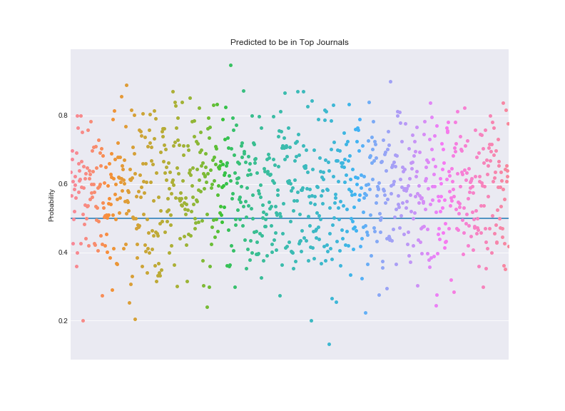
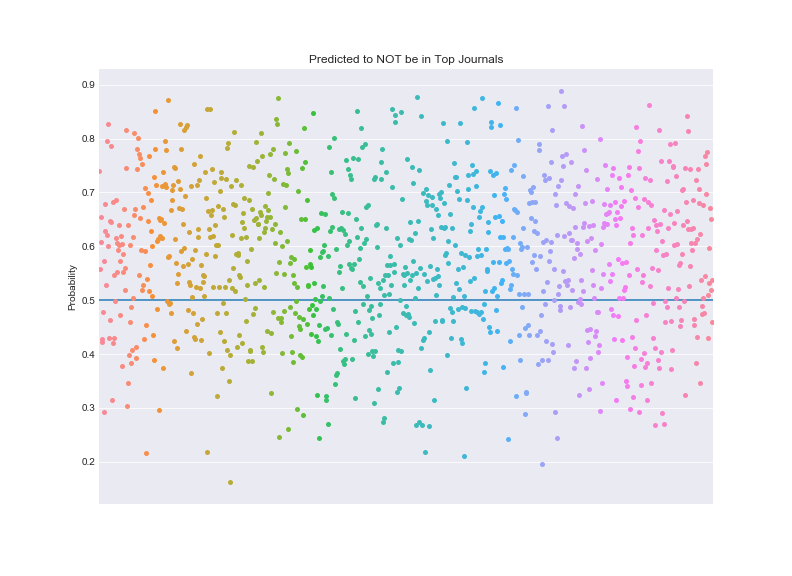

## **Predict Research Significance Based on Its Abstract**

### * Biological Journals Abstract Significance Predictor: 
    https://if-pred.herokuapp.com/
### * Economics Journals Abstract Significance Predictor: 
    https://econ-abstract-significance.herokuapp.com/
### * Google Slides Presentation:
    https://docs.google.com/presentation/d/1BgY_zI7OSDwChVjTQkBQ64Y742lSjjiq8hr2UVL7910/edit?usp=sharing
### * Other visualizations for the biological journals abstracts:
    https://s3.us-east-2.amazonaws.com/www.topic-visualization.com/index.html#topic=4&lambda=1&term=

### **1) Biological Journals**
#### A. Data Collection  
Raw data were fetched from [Pubmed](https://www.ncbi.nlm.nih.gov/pubmed/) in Medline format with different start date, and were divided into three groups:  
  * **Group 1** includes publications from **20** journals:  
  Nature (from: 2017-01-01), Science (from: 2017-01-01), Cell (from: 2017-01-01), New England Journal of Medicine (nejm) (from: 2015-01-01), Nature Genetics (nat_genet) (from: 2015-01-01), Nature Biotechnology (nat_biotechnol) (from: 2015-01-01), Nature Medicine (nat_med) (from: 2015-01-01). 
  Cancer Cell (from: 2015-01-01), 
Nature Immunology (nat_immunol) (from: 2015-01-01), 
Cell Metabolism (cell_metab) (from: 2015-01-01), 
Cell Stem Cell (from: 2015-01-01), 
Nature Cell Biology (nat_cell_biol) (from: 2015-01-01), Nature Methods (nat_methods) (from: 2015-01-01), Nature Structural & Molecular Biology (nat_stru_mol_biol) (from: 2015-01-01), Nature Neuroscience (nat_neuro) (from: 2015-01-01), 
Molecular Cell (mol_cell) (from: 2015-01-01), Immunity (from: 2015-01-01), Journal of Clinical Oncology (jco) (from: 2017-01-01), Gut (from: 2015-01-01), Gastroenterology (gastro) (from: 2017-01-01). 

* **Group 2** includes publications from **15** journals:  
Neuron (from: 2016-01-01), The Journal of Clinical Investigation (jci) (from: 2017-01-01), Hepatology (from: 2017-01-01), Blood (from: 2017-01-01), Genes & Development (gd) (from: 2015-01-01), Developmental Cell (dev_cell) (from: 2015-01-01), Elife (from: 2017-01-01), Proceedings of the National Academy of Sciences of the United States of America (pnas) (from: 2017-09-01), PLOS Biology (plos_biol) (from: 2016-01-01), Current Biology (cb) (from: 2017-01-01), Nucleic Acids Research (nuc_acid_res) (from: 2017-06-01), The EMBO Journal (embo_j) (from: 2016-01-01), Cell Research (cell_res) (from: 2016-01-01), Nature Communications (nat_comm) (from: 2018-01-01), Plos Medicine (plos_med) (from: 2015-01-01).

* **Group 3** includes publications from **11** journals:  
Science Signaling (sci_signal) (from: 2015-01-01), Journal of Biological Chemistry (jbc) (from: 2017-01-01), Scientific Reports (sci_rep) (from: 2018-02-01), Plos One (from: 2018-02-01), Development (from: 2016-01-01), Developmental Biology (dev_biol) (from: 2016-01-01), Molecular and Cellular Biology (mcb) (from: 2015-01-01), Journal of Cell Biology (jcb) (from: 2016-01-01), 
Oncotarget (from: 2018-01-01), Journal of Molecular Biology (jmb) (from: 2016-01-01), Oncogene (from: 2016-01-01).

#### B. Data Munging
* Downloaded medline formatted data from each journal were converted to pandas dataframe type with columns: **'PMID', 'Title', 'Abstract'** and **'Journal'**. Detailed code could be found in ***format_convert.py***. 

* All converted data in the same group were combined into one single dataframe. Records with incorrect data in **'Abstract'** column were removed. Detailed code could be found in ***data_combine.py*** 

* Summary of the cleaned data were shown below: 
    * Total data in all groups: 
     
    * Counts in individual groups: 
    
    
     

#### C. Feature Engineering
* Data split:
 1. Data in each group were randomly shuffled by rows;
 2. 20% of data were used as test data, and 80% of data were used as training data. 
  
* Nature language processing:
 1. Each word in abstract was lemmarized and lower cased;
 2. None English words and stop words were removed;
 3. Customized stop words were removed. 
  
* Data combination: 
    Cleaned abstracts in all groups were combined into single csv file (**x_train.csv** & **x_test.csv**). And their corresponding labels were also combined into single csv file with same order (**y_train.csv** & **y_test.csv**).    
     
* Detailed code could be found in ***data_clean.py***

#### D. Model Training
working on it

### **2) Economic Journals**
#### A. Data Collection  
Web scraped journal abstracts from [ideas.repec.org](https://ideas.repec.org/top/top.journals.simple10.html) 
for top economic journals in terms of 10 year impact factors. Python and BeautifulSoup were used. 
The web scrape covered the first page in the article list for 
each journal, which usually ended up with 200 abstracts per journal. 

Two groups were considered: 

    * Top journals: A sample of the top 20 journal abstracts, including from journals listed twice in the list 
    as these journals contained abstractrs from a different time period. Includes a mix of latest abstracts along with occasional abstracts 
    from older time periods (no later than 2000).

    * Not Top journals: A sample of the latest abstracts from a random sample from journals rank 20-100 of 28 non-distinct journal abstracts. 

#### B. Data Munging
Saved the results into a pandas dataframe, added the top_journals column where top_journals == 1 for true and 0 for false. 
Cleaned the results for rows lacking abstracts (e.g. “No abstract is available…”) and manually deleted short non-descriptive abstracts. Then 
removed nonsensical strings (e.g. “type="main" xml:lang="en">) from the rows. 
Top journals ended up with a total of 4091 rows and Not Top journals ended up with a total of 4063 rows. 
Then the dataframe was saved as csv files. 

#### C. Feature Engineering
Using the Natural Language TookKit in python, the data was cleaned of stopwords.
Using SKLearn in python the dataset was split into a training set and a testing set, with 75% training and 25% testing.

#### D. Model Training
After using the Hash Vectorizor in SKLearn to transform abstracts into a matrix of token occurrences, I fitted the data to a logistic regression model, with a mean accuracy of 70.87% on the testing data. 

 
 

This was originally only a preliminary model but after fitting the data to multiple other models, we could not find another that performed better (see ML_Econ_bb.ipynb for more details).

#### E. Website
Created a simple webpage for users to input abstracts using Flask in python and deployed to Heroku. The html file can be found under index_econ.html in the templates folder, where the flask app can find it. The app itself is under app_econ.py. The app imports the saved (pickled) trained logistic regression model and when the submit button is clicked, hashes any user input texts and returns a prediction using the imported model.  